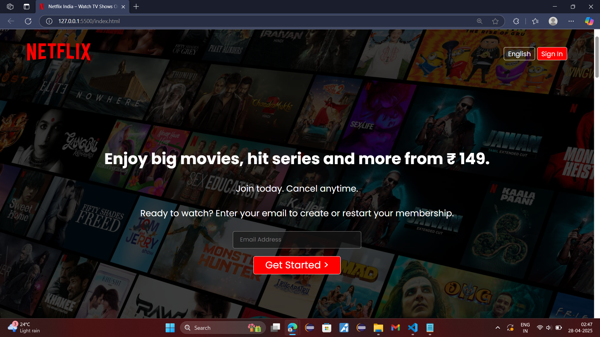
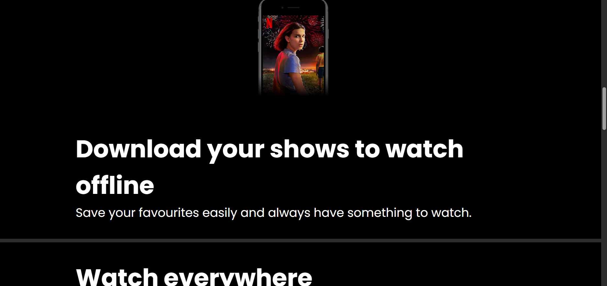
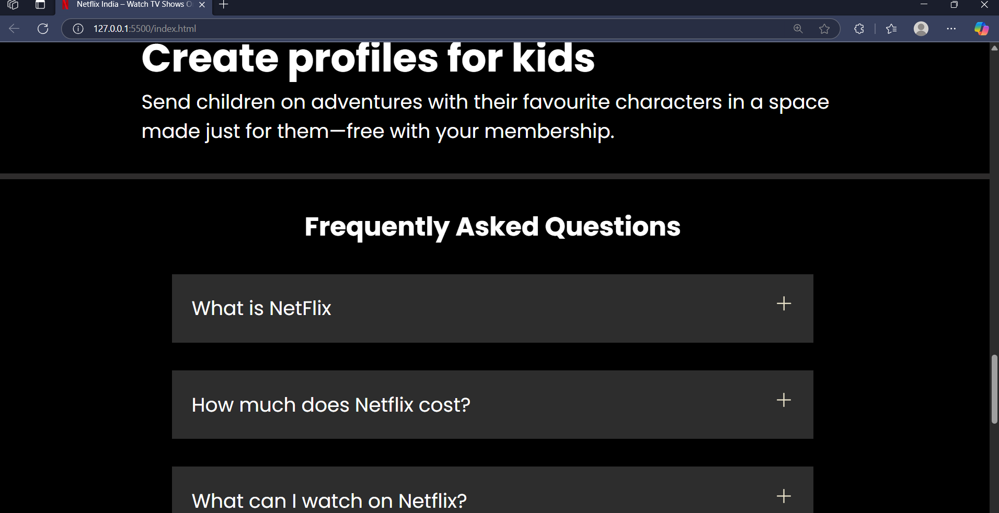

# Netflix Clone

A simple **Netflix Webpage Clone** built using only **HTML**, **CSS**, and **media assets**.

## Project Structure

- `assets/` contains all images, videos, and SVGs used in the project.
- `index.html` is the main HTML file.
- `style.css` contains all the styling for the webpage.
- `netflix-logo.svg` is the Netflix logo used outside the assets folder.

## How to Run

1. **Download** the following:
   - The entire `assets` folder
   - `index.html`
   - `style.css`
   - `netflix-logo.svg` (if it's outside the assets folder)

2. **Open** the `index.html` file directly in your browser.

No additional setup is required.  
Just open and enjoy your Netflix clone! 🚀

---

## Screenshots

### Home Page

### Video Section

### Footer Section

---

## License

This project is for educational purposes only.  
All media assets are used for learning and demonstration.
